A CLI tool to generate images from diagram files. Supports Mermaid, Excalidraw, and more. DiagramKit watches diagram source files and generates SVG or PNG output with light and dark theme variants, making it easy to embed scheme-aware diagrams in documentation and websites.

## Architecture




## What It Does

- **Multi-format support** --- Renders Mermaid (`.mmd`) and Excalidraw (`.excalidraw`) source files to images
- **Theme variants** --- Generates both light and dark versions of each diagram automatically
- **SVG and PNG output** --- Configurable output formats per project
- **Watch mode** --- Monitors source files and regenerates on change
- **Manifest tracking** --- Uses a manifest to skip unchanged diagrams for fast incremental builds

## Key Features

| Feature                | Description                                                   |
| ---------------------- | ------------------------------------------------------------- |
| **Mermaid support**    | Renders `.mmd` files to SVG/PNG via mermaid-cli               |
| **Excalidraw support** | Renders `.excalidraw` files to SVG/PNG                        |
| **Dual themes**        | Generates light and dark variants automatically               |
| **Incremental builds** | Manifest-based change detection skips unchanged diagrams      |
| **Watch mode**         | `--watch` flag for continuous regeneration during development |
| **Force rebuild**      | `--force` flag to regenerate all diagrams regardless of cache |

## Getting Started

```bash
npm add -D diagramkit
npx diagramkit
```

Configure via `diagramkit.config.json5` at the project root:

```json5
{
  outputDir: ".diagramkit",
  defaultFormats: ["svg"],
  defaultTheme: "both",
  sameFolder: true,
  useManifest: true,
}
```
