Engineering teams write documentation in Markdown because it lives alongside code, diffs cleanly in pull requests, and works with every editor. But many organizations mandate Confluence as the single source of truth for internal documentation. md2cf bridges this gap --- it converts Markdown to Atlassian Document Format (ADF) and publishes directly to Confluence Cloud via the REST API v2.

## Architecture

<div class="diagram-themed">
  
  
</div>

## What It Does

md2cf takes Markdown content from three source types --- local files, remote URLs, or entire directory trees --- and publishes it to Confluence Cloud pages.

- **Single-file sync** --- Updates an existing page or creates a new one.
- **Recursive folder sync** --- Mirrors a local directory structure to Confluence. Folders become container pages, Markdown files become content pages.
- **Mermaid diagram support** --- Renders fenced `mermaid` code blocks to PNG, uploads as Confluence attachments, and injects ADF media references.
- **TOC macro injection** --- Replaces Markdown TOC sections with Confluence's native TOC macro.

## Key Features

| Feature                   | Description                                                                      |
| ------------------------- | -------------------------------------------------------------------------------- |
| **Recursive folder sync** | Mirrors local directory trees to Confluence page hierarchies in a single command |
| **Mermaid rendering**     | Renders diagrams to PNG, uploads as attachments, and embeds in pages             |
| **Dry-run mode**          | `--dry-run` previews all actions without making API calls                        |
| **Remote source support** | Syncs from raw GitHub URLs or any HTTP-accessible Markdown file                  |
| **Library API**           | Core modules exported for programmatic use                                       |

## Getting Started

```bash
npm install -g md2cf
```

Configure your Confluence credentials:

```bash
md2cf config
```

Sync a Markdown file to an existing page:

```bash
md2cf ./README.md https://company.atlassian.net/wiki/spaces/ENG/pages/12345
```

Sync an entire docs folder:

```bash
md2cf ./docs/ https://company.atlassian.net/wiki/spaces/ENG/pages/12345
```

## Tech Stack

| Component             | Technology                              |
| --------------------- | --------------------------------------- |
| **Language**          | TypeScript (strict mode, ES2022 target) |
| **Runtime**           | Node.js 24+ (ESM only)                  |
| **CLI framework**     | Commander.js                            |
| **Markdown to ADF**   | marklassian                             |
| **Diagram rendering** | @mermaid-js/mermaid-cli                 |
| **Testing**           | Vitest (90% coverage thresholds)        |
