A static site generator for markdown-driven personal projects, with typed layouts and quiet enhancement. Pagesmith is a filesystem-first content toolkit with three public packages: `@pagesmith/core` (headless content layer), `@pagesmith/site` (site toolkit), and `@pagesmith/docs` (opinionated docs preset).

## Architecture

<div class="diagram-themed">
  
  
</div>

## What It Does

- **Schema-validated content collections** loaded from the filesystem
- **Lazy markdown rendering** with headings and read-time metadata
- **Framework-agnostic content APIs** for React, Solid, Svelte, vanilla JS, Node, Bun, or Deno
- **Convention-based docs sites** built from markdown content plus a single config file
- **Built-in Pagefind search**, syntax highlighting via Shiki, and automatic navigation from folder structure

## Key Features

| Feature               | Description                                                                  |
| --------------------- | ---------------------------------------------------------------------------- |
| **Filesystem-first**  | Content collections defined by directory structure with schema validation    |
| **Typed layouts**     | Layout overrides via `theme.layouts` with full TypeScript props              |
| **Markdown pipeline** | Fenced code blocks with Shiki, GitHub Alerts, Mermaid diagrams, math support |
| **Zero-config mode**  | Works out of the box when following `docs/` + `gh-pages/` conventions        |
| **Search**            | Built-in Pagefind integration for full-text search                           |
| **AI-first workflow** | Ships AI guidelines, JSON schemas, and MCP server for agent tooling          |

## Getting Started

```bash
npm add @pagesmith/docs
npx pagesmith init --yes --ai
npx pagesmith dev
```
