Design systems promise consistency and velocity, but most implementations force a hard choice: adopt a framework-coupled component library and accept the lock-in, or maintain raw CSS that drifts between projects. Paramanu takes a different path: CSS-first components with a dual API (BEM class strings for any template engine or CDN, CSS Modules for bundler-based tree shaking), a three-tier token system for deep theming, and thin framework adapters that are generated rather than hand-written.

## Architecture




## What It Does

Published as 22 packages under the `@paramanu/*` npm scope, Paramanu provides a complete component library across 11 functional categories with WCAG 2.2 AA compliance as a core constraint.

- **Dual API for every component** --- BEM class builders for templates/CDN + CSS Modules for bundlers. Same props, same styles, different consumption modes.
- **Three-tier design token system** --- Primitive, semantic, and component-level tokens compiled from DTCG JSON via Style Dictionary.
- **Five built-in themes** --- Material, Ant Design, Bootstrap, Light Modern, and Dark Modern.
- **Framework adapters** --- React adapters wrap each component with `forwardRef`, mapping component props to class builder calls.

## Key Features

| Feature                    | Description                                                                                  |
| -------------------------- | -------------------------------------------------------------------------------------------- |
| **CSS-first architecture** | Styling logic lives in CSS `@layer` declarations, not in JavaScript                          |
| **Dual API**               | BEM classes for templates/CDN + CSS Modules for bundlers                                     |
| **Three-tier tokens**      | Primitive, semantic, and component-level tokens compiled from DTCG JSON via Style Dictionary |
| **Five built-in themes**   | Material, Ant Design, Bootstrap, Light Modern, and Dark Modern                               |
| **WCAG 2.2 AA**            | Accessibility baked into component CSS and tested with vitest-browser + axe-core             |
| **Tree-shakeable imports** | Import only the components you use                                                           |

## Getting Started

```bash
# Tokens + buttons (minimal)
pnpm add @paramanu/tokens @paramanu/buttons-js

# With React adapter
pnpm add @paramanu/tokens @paramanu/buttons-js @paramanu/buttons-react
```

```typescript title="main.ts"
// Foundation (must be first)
import "@paramanu/tokens/css/layer-order";
import "@paramanu/tokens/css/reset";
import "@paramanu/tokens/css";

// Component CSS
import "@paramanu/buttons-js/css";
```

## Tech Stack

| Component          | Technology                                                       |
| ------------------ | ---------------------------------------------------------------- |
| **Language**       | TypeScript 5.x (strict mode)                                     |
| **Styling**        | CSS custom properties, `@layer`, `light-dark()`, BEM methodology |
| **Token compiler** | Style Dictionary (DTCG format)                                   |
| **CSS processing** | lightningcss                                                     |
| **Monorepo**       | pnpm workspaces + Turborepo                                      |
| **Testing**        | Vitest 4.x + @vitest/browser + Playwright + axe-core             |
